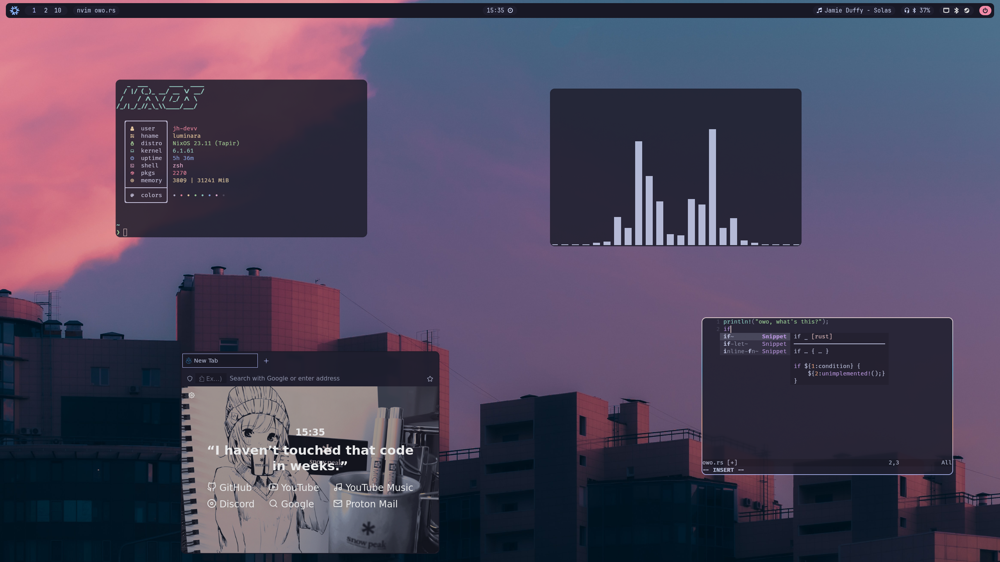

<h1 align="center">jh-devv/luminara</h1>

## ➔ 🗒 About

Hey! This is my flake for my NixOS setup `Luminara` ( ˶ˆ꒳ˆ˵ )

Managed with Nix (NixOS) and Home Manager! :3

[🗃️ contents](#--contents) 📷 [screens](#--screens) 📝 [info](#--info) 💻
[usage](#--usage)

## ➔ 🗃️ contents

- [modules/nixos](modules): NixOS common configs
- [modules/home](modules): HM common configs
- [hosts](hosts): host-specific configuration
- [home](home): user-specific configuration
- [pkgs](pkgs): package definitions

## ➔ 📷 screens



---

## ➔ 📝 info

### desktop

```text
OS: NixOS
Compositor: Hyprland
Bar: Waybar
GTK Theme: Catppuccin GTK
Icon Theme: Catppuccin Folders and Papirus
Font: Fira Code/JetBrains Mono Nerd Font
```

### terminal

```text
Terminal: Kitty
Shell: Zsh
Fetch: Nitch
Prompt: Starship
Editor: Neovim
```

### apps

```text
Browser: Firefox
File Manager: Nautilus
```

---

## ➔ 💻 usage

before you use them, are you sure you are familiar with nix? ^w^

first, be sure to edit `hosts/<host>` and edit the `flake.nix`, do the same with
home manager `users/<user>`

for nixos:

```bash
just nixos
```

for home manager:

```bash
just home-manager
```

## License

[AGPL-3 License](LICENSE) © [jh-devv](https://jh-devv.com)
